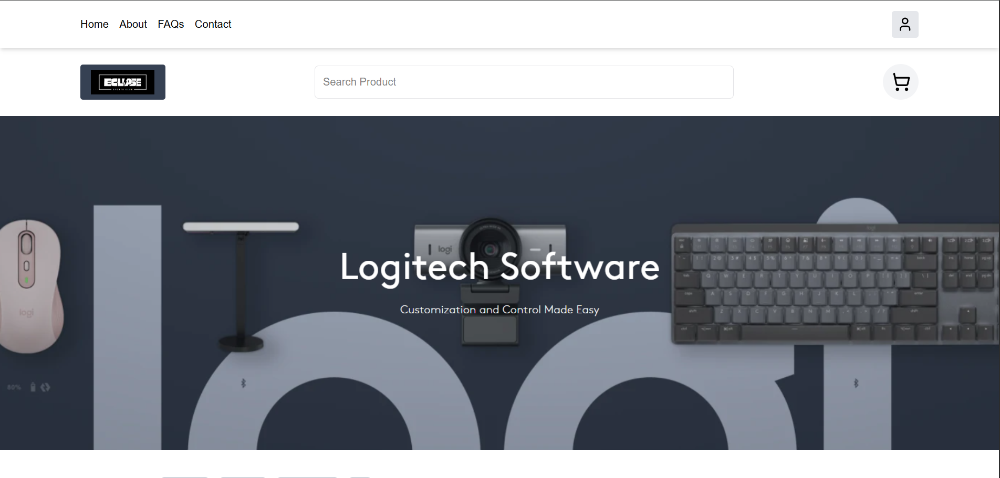
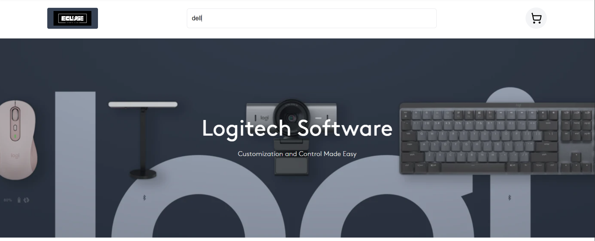
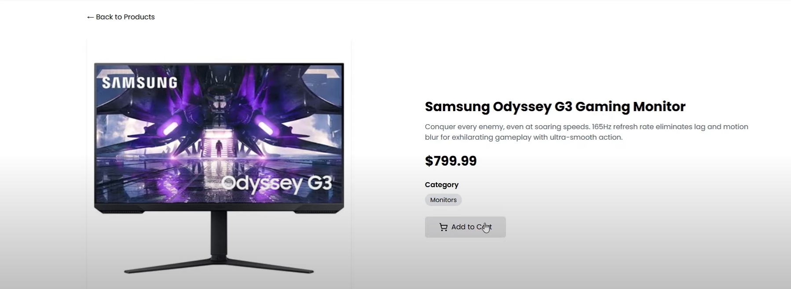
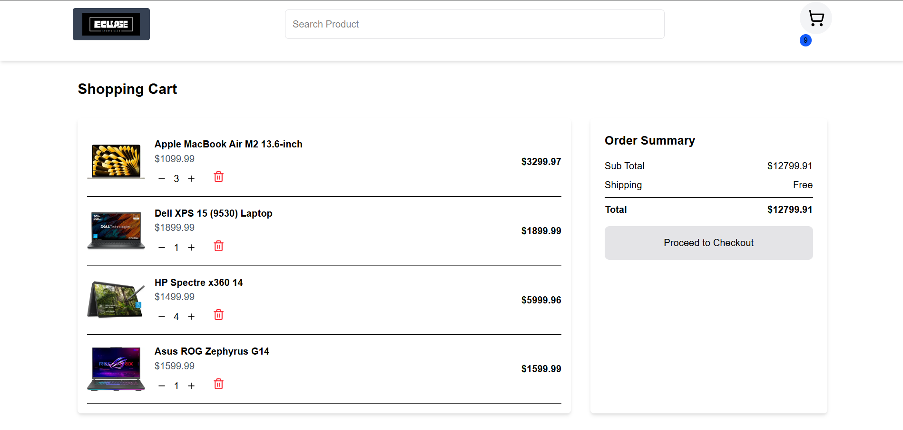

# 🛒 E-Commerce Website

This is a simple, fully functional e-commerce website built using **React**, **Tailwind CSS**, and **Redux Toolkit**.  
It fulfills all mandatory requirements like product listing, search/filter, add to cart, cart management, and responsive design.  
Screenshots showcasing different sections are provided below.

---

## 📋 Features

- View a list of products (images, title, description, and price)
- Search or filter products by **category** or **name**
- Add products to cart
- View items in cart with total price
- Remove items from cart
- Fully **Responsive** for desktop and mobile

---

## 🚀 Tech Stack

- **Frontend:** React.js, Tailwind CSS
- **State Management:** Redux Toolkit
- **Other:** React Router

---

## 🖥️ Screenshots

| Home Page (Product Listing) | Search Feature |
|:----------------------------:|:---------------------:|
|  |  |


| Listed Product Page |
|:---------:|
|  |

| Product Details Page |
|:---------:|
|  |

| Cart Page |                                                
|:---------:|
|  |

> 📂 All screenshots are available in the `/screenshots/` folder inside the project.

---

## 📦 Installation

Clone the repository:

```bash
git clone https://github.com/GKmaster-coder/web-dev-task-by-careerkick-using-React-redux.git
cd web-dev-task-by-careerkick-using-React-redux
```

Install dependencies:

```bash
npm install
```

Start the development server:

```bash
npm run dev
```

The app will be live on `http://localhost:5173/` or your specified port.

---


## 🛠️ Project Structure

```new-web
├── public/
├── src/
│   ├── assets/
│   ├── components/
│   ├── pages/
│   ├── redux/
│   ├── App.jsx
│   └── main.jsx
├── screenshots/
├── package.json
├── tailwind.config.js
└── README.md
```

---

## 📄 Assignment Details

This project was built as part of the **Web Developer Assignment** with the following objectives:

- Demonstrate frontend skills (React, TailwindCSS)
- UI/UX responsiveness
- Implement dynamic functionality (search, filter, cart)


---

## 📞 Contact

Created with ❤️ by **Gourav Kashyap**  
[](https://instagram.com/gouravkashyap2468)
[](https://linkedin.com/in/gourav-kashyap-0241722a3) 
[](mailto:gouravkashyap2468@gmail.com) 
